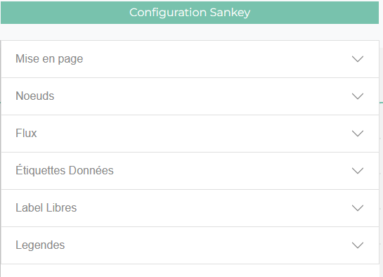

*******************
Outlis d'Opensankey
*******************

Menu de configuration
=====================

Le menu de configuration est un menu accordéon contenant tous les outils nécessaires à l'édition de diagrammes de sankey.

.. toctree::
    :maxdepth: 6

    user_tools_menu_config

Barre d'édition
===============

La barre d'édition est un ensemble de bouton permettant de faciliter certaines foncitionnalités d'édition du diagramme et d'appliquer des filtre

.. toctree::
    :maxdepth: 2

    user_tools_edition_banner