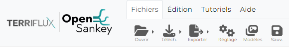

La partie gauche de la barre d'édition contient des sélecteur du comportement de la souris. Pour choisir le comportement de la souris il faut simplement cliquer sur le mode qui nous intéresse.

Fichiers
========

**Ouvrir**
 
 * Un fichier **JSON** contenant les données au format utilisé par l'application
 * Un fichier **Excel** contenant les données dans format spécialement fait pour OpenSankey

**Télécharger**

    Enregistre les données utilisé par l'application sur l'ordinateur:

    * Au format **JSON**
    * Au format **Excel**

**Exporter**

    Permet de créer une image du sankey actuel :

    * Au format **SVG**
    * Au format **PNG**
    * Au format **PDF**

**Réglage**

    Permet de modifier quelques varaible de l'application tel que :

    * La **langue** de l'application
    * Le sous menu visible dans le menu de configuration (avec des mode pré-définis : Simple/Expert)

**Modèles**

    Ouvre un modale avec des exemple de diagramme de sankey que l'on peut ouvrir et modifier. Ces modèles montrent également ce que l'on peut produire avec l'application.

**Sauvegarde**

    Enregistre les données actuel dans le navigateur, peut-être utile quand l'on veut apporter des modifications dont on ne sait pas ils seront pertinents et donc pouvoir revenir à une version satisfaisante en rechargant l'application 

Édition
=======

**Reinitialiser**

    Bouton permetant de réinitialiser le sankey.

**Transformation**

    Ouvre un modale qui permet de modifier le sankey actuel avec des variables d'un autres sankey

    .. image:: _static/navbar_edition_trans.PNG
        :align: center

   Après avoir choisis un sankey via le sélecteur de fichier (au format JSON), on choisis différents attributs que l'on veut importer du fichier.

**Styles**

    Permet d'ouvrir un modal où l'on peut créer, modifier  et supprimer des styles de noeuds et flux. Les styles sont les valeurs par défaut des noeuds/flux auxquels ils sont associés.
    
    Les variables des styles concenent les attributs d'apparences des noeuds/flux (couleur,taille des labels,...)

    *Exemple du modale d'édition des styles de noeuds:*

        .. image:: _static/navbar_edition_style.PNG
            :align: center

Filtres
=======

    .. image:: _static/navbar_filtre.PNG
            :align: center

    Ce sous-menu de navigation apparait quand il y a au au moins un groupe d'étiquette dans les données (groupe d'étiquette de noeud, flux ou données)

    Il permet d'afficher ou cacher des éléments selon leur étiquette associée, voir appliquer la palette de couleurs du groupe d'étiquette définies dans le menu de configuration. 
    Les couleurs des différentes étiquettes du groupe sont affichées généralement en haut a gauche dans la zone de dessin quand on choisis d'appliquer les couleurs d'un groupe d'étiquette.

Tutoriels
=========

    Ouvre un modale contenant des sankey tutoriels qui permettent la prise en main de l'application
    
    Le modale contient plusieurs sous-parties pour explorer les fonctionnalités de l'application allant du plus simple au plus difficile

    .. image:: _static/navbar_tuto.PNG
            :align: center

Aide
====

    .. image:: _static/navbar_help.PNG
            :align: center

Ce sous-menu permet d'ouvrir différentes aide :

        * Le **modal de bienvenue** qui contient des informations sur l'application et les raccourcis clavier
        * Un lien vers la **documentation**
        * Un lien vers l'addresse **mail de support** si vous rencontrez des bugs sur l'application