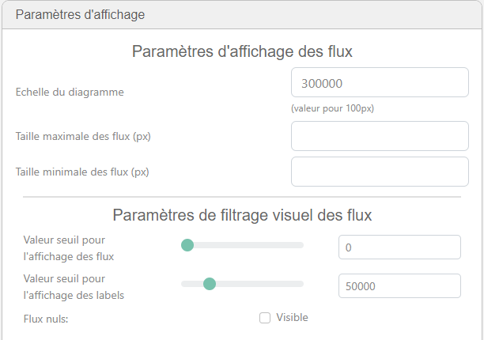
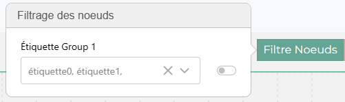
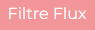
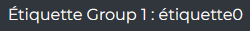
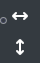

La partie gauche de la barre d'édition contient des sélecteur du comportement de la souris. Pour choisir le comportement de la souris il faut simplement cliquer sur le mode qui nous intéresse.

Bouton de sélection
=======================

Ce mode permet de sélectionner des élements du diagramme tel que les noeuds,flux et labels libre (via Ctrl+click) et de les déplacer en les draggant

Bouton d'ajout de flux et noeud
===================================

Ce mode permet :

* soit de créer un flux entre 2 noeuds déjà existant en draggant la souris entre 2 noeuds
* soit créer un noeud au click et/ou relachement de la souris

Bouton du choix des niveau d'agrégation du sankey
=================================================

.. image:: _static/aggregation_button.PNG
   :align: left
   :width: 20
   :height: 20

Ce boutton permet de choisir les niveau d'agrégation des différents groupes d'agrégation, les groupes d'agrégations sont une hiérarchie entre les noeuds, ces groupes ne peuvent être formés qu'à partir d'un fichier excel.

Bouton pour ouverture du pop-up de seuil des flux
=================================================

.. image:: _static/link_threshold_button.PNG
   :width: 20
   :height: 20

Pop-up de seuil des flux
------------------------

Le pop-up permete de modifier les variables concernant l'affichage des flux :

* **L'échelle**: Permet de reduire ou augumenter l'échelle du diagramme et ainsi modifier l'épaisseur des flux 
* **La taille max des flux**: Permet choisir l'épaisseur maximum des flux en px 
* **La taille min des flux**: Permet choisir l'épaisseur minimale des flux en px 

* **Seuil d'affichage des flux**: Permet choisir un seuil de valeurs des flux sous lequel les flux ne sont pas affichés
* **Seuil d'affichage des labels**: Permet choisir un seuil de valeurs des flux sous lequel les labels de flux ne sont pas affichés
* **Afficher les flux nul**: Permet d'afficher les flux qui ont pour valeur 0, par défaut les flux n'ont pas de valeur et sont donc affichés en pointillés pour montrer qu'ils n'ont pas d'informations 

Filtres noeuds
==================

Ce bouton permet d'appliquer des groupes d'étiquettes de noeuds sur le diagramme (`*voir Groupe d'étiquette* <user_tools_tag.html#comment-creer-des-groupes-et-des-etiquettes>`__)

Filtres Flux
================

Ce bouton permet d'appliquer des groupes d'étiquettes de flux sur le diagramme (`*voir Groupe d'étiquette* <user_tools_tag.html#comment-creer-des-groupes-et-des-etiquettes>`__)

Filtres sur les étiquettes de données
=====================================

Ce bouton permet de filtrer les valeurs de flux, on peut sélectionner une pour plusieurs étiquettes de données qui affichera plusieurs fois le même flux avec les différentes valeurs (`*voir Groupe d'étiquette* <user_tools_tag.html#comment-creer-des-groupes-et-des-etiquettes>`__)

Réajuster la taille du diagramme
================================

Permets de réajuster la zone de dessin afin que le diagramme soit visible soit :

* Du noeud le plus à gauche au noeud le plus à droite
* Du noeud le plus en haut au noeud le plus en bas

Mode structure
==============

