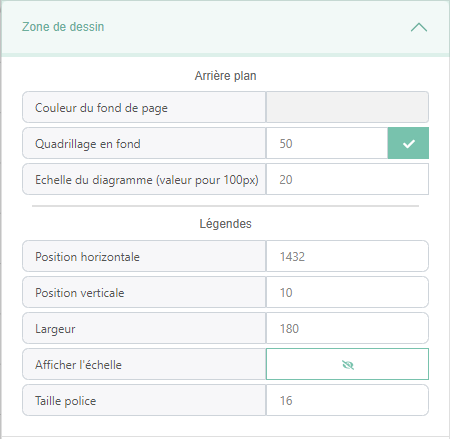
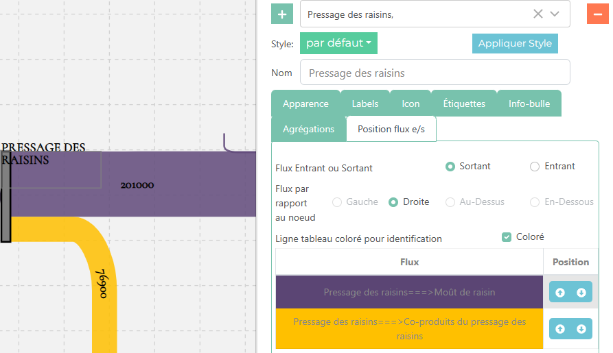
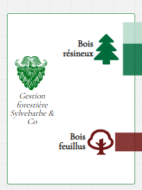

Mise en page
============
La mise en page est onglet du menu de configuration permettant de gérer des caractèristiques global de la zone de dessin.

Les différents paramètres modifiables sont :

* **L'échelle**: Permet de reduire ou augumenter l'échelle du diagramme et ainsi modifier l'épaisseur des flux
* **Flux Maximum**:
* **Taille Carré Grille** et **Grille visible**: Permet de choisir la taille des carrés du grillage de fond de la zone de sankey. Ce grillage aide lorsque l'on veut aligner les différents élements du diagramme.
* **Arranger les noeuds**:
* **Ecart entre noeuds Horizontal/Vertical**: Permets de choisir l'écart vertical et horizontal entre les différents noeuds  pour que, lorsque le bouton **positionnement automatique** est clické, les noeuds se positionnent

Edition noeuds
==============

L'onglet d'édition permet de modifier les paramètres des noeuds du diagramme. Cet onglet contient une partie supérieur qui permet de sélectionner, créer,supprimer et modifier des noeuds.
Ensuite, après avoir sélectionner des noeuds, il possible de modifier des paramètres plus spécifiques regroupé dans des sous-onglets:

**Apparence**:

Dans cet onglet, nous pouvons mdoifier des paramètres visuels des noeuds tel que :

* Sa **visibilité**
* Sa **couleur**
* Si ca couleur reste quand une étiquette est sélectionné
* Sa **forme** (soit une ellipse soit un rectangle)
* Sa **largeur** et **hauteur minimum**, car la taille d'un noeud peut augumenter selon les flux entrant et sortant

**Labels**

Dans cet onglet, nous pouvons mdoifier des paramètres liés aux labels des noeuds tel que :

* Sa **visibilité**
* Si il est de couleur **blanc** ou non (utilé si le label est placé sur le noeud)
* Sa **position vertical** par rapport au noeud
* Sa **position horizontal** par rapport au noeud
* La **taille de la police**
* La **police de caractère** (Gras,Majuscule,Italique)
* La **longueur des labels**, si les labels des noeuds sont trop long il est possible de faire des retour à la ligne
* **Afficher la valeur des noeuds**, affiche le maximum entre la somme des liens entrants et la somme des liens sortants
* La **position vertical de la valeur** par rapport au noeud
* La **position horizontal de la valeur** par rapport au noeud
* La **taille de la police de la valeur**

**Icon**

Dans cet onglet, on gère l'insertion d'icon dans les noeuds. Au préalable il faut avoir charger une liste d'icon provenant d'icomoon dans le menu préférectangle
Les différents paramètres de cette onglet sont :

* Sa **visibilité**
* L'**icon** que l'on veut afficher
* Sa **couleur**
* Son **ratio** : sa taille par rapport au noeud

**Info-bulle**

Dans cet onglet on gère le contenue le l'info-bulle qui s'affiche lorsque l'on survol les noeuds tous en ayant les la touche **shift** pressé.

**Agrégation**

**Position flux e/s**

Dans cet onglet qui n'apparait que si l'on sélectionne qu'un seul noeud, on gère la position des flux entrant sortant permettant de mieux les organiser
Il est composé d'une partie avec des sélecteurs et d'une partie avec un tableau

Les sélecteurs permettent spécifié si l'on veux organiser les liens entrant ou sortant et de quel côté. Il y a aussi un boutnon pour coloré les lignes du tableau pour mieux pour voir identifier les liens du diagramme

Ensuite le tableau affiche les liens répondant à ces critères et avec la colone position nous pouvons modifier la position des flux attachés aux noeuds

Edition des étiquettes de noeuds
================================
.. toctree::
    :maxdepth: 2

    user_tools_tag

Edition flux
============

L'onglet d'édition permet de modifier les paramètres des flux du diagramme. Cet onglet contient une partie supérieur qui permet de sélectionner, créer,supprimer et modifier des noeuds, et d'une partie inférieur qui, après avoir sélectionner des flux, permet de modifier des paramètres plus spécifiques regroupés dans des sous-onglets:

Parmis les paramètres généraux modifiables des flux il y a :
* Leur **source/cible**
* La possibilté de **cacher** les noeuds de type produit qui sont seuls entre 2 flux
* **Inverser** la source/cible
* Déplacer des liens par **dessus/dessous** les autres
* Appliquer un **style** au noeud

Les paramètres spécifiques regroupé par catégories sont :

**Données**

Cet onglet permet d'attribuer une valeur aux flux.

* Les flux peuvent avoir des étiquettes de données qui correspondent à des **filtres**.
* Nous pouvons y renseigner la **valeur** pour ces filtres
* Nous pouvons afficher la valeur de ces flux de manière **scientifique** ou non
* Nous pouvons choisir d'afficher un **texte** au lieu de la valeur

**Apparence**

Cet onglet gère des paramètres visuels des flux tel que :

* Sa **couleur**
* Si sa couleur est un **gradient** (si l'option est sélectionné le grandient est un dégradé de couleur à partir de la couleur du noeud source vers la couleur du noeud cible)
* Si le flux est **hachuré**
* L'orientation du flux :

    * **Horiz-Horiz** : Le flux part du noeud source à l'horizontal et arrive au noeud cible à l'horizontal
    * **Vert-Vert** : Le flux part du noeud source à la vertical et arrive au noeud cible à la vertical
    * **Vert-Horiz** : Le flux part du noeud source à la vertical et arrive au noeud cible à l'horizontal
    * **Horiz-Vert** : Le flux part du noeud source à l'horizontal et arrive au noeud cible à la vertical

* **Position du centre**
* **Ecart entre les poignées**
* **Type de courbe**:
    * ca peut être un flux avec des traits doits ou **courbé**
    * avoir une **flêche** pour connaitre le sens du flux
    * Être en mode **recyclage** donnant une forme au flux pour montrer un retour en arrière dans le diagramme

* La tension de la courbure si l'option est sélectionné

**Label**
Cet onglet gère les paramètres liés aux labels des flux tel que :

* Sa **visibilité**
* Sa **couleur**
* La **taille de sa police**
* **Alginer le texte avec le chemin du flux** (suit la courbure du flux au lien de rester horizontal)
* **Position latérale** du texte (au début du flux, au milieux du flux ou à la fin du flux)
* **Position orthogonale** du texte (au dessus du flux, au milieux du flux ou en dessous du flux)
* L'option de **positionner le label à la souris**, détaché du flux

**Info-bulle**

Dans cet onglet on gère le contenue le l'info-bulle qui s'affiche lorsque l'on survol les flux tous en ayant les la touche **shift** pressé.

Edition des étiquettes de flux
==============================

.. toctree::
    :maxdepth: 2

    user_tools_tag

Edition des étiquettes de données
=================================

.. toctree::
    :maxdepth: 2

    user_tools_tag

Label Libres
============

Dans cet onglet on gère les labels libres qui sont des zone de textes que l'on peut placer où l'on veut. On peut aussi les utlisé pour repésenter des groupes d'élements sur le diagramme.

Les paramètres modifiables des labels libres sont :

* Son **texte**
* **Considérer le texte comme un élément foreignObject** qui permet d'écrire du html dans la zone de texte
* La **hauteur** du label libre
* La **largeur** du label libre
* Si son **fond est transparent**
* La **couleur de fond** du label libre
* Si la **bordure est transparente**
* La **couleur de la bordure**
* Sa **position vertical** par rapport au label libre
* Sa **position horizontal** par rapport au label libre
* La **taille de la police** du label libre
* La **police de caractère** (Gras,Majuscule,Italique)

Légendes
========

Cet onglet gère la position et taille de la légende du groupe d'étiquettes sélectionnés